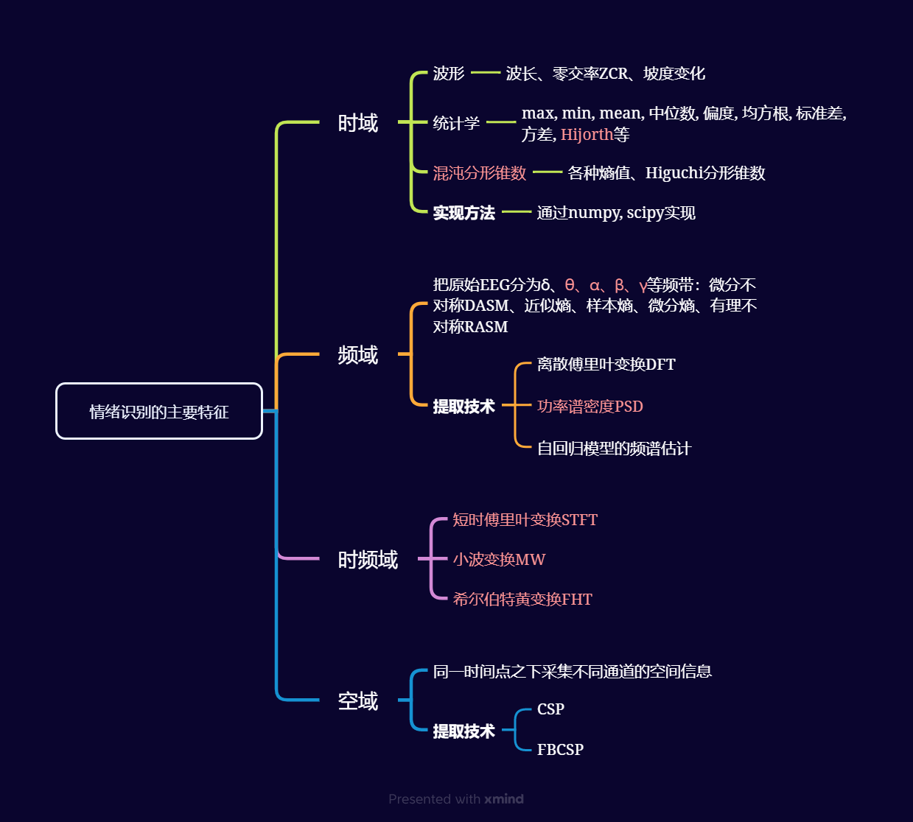
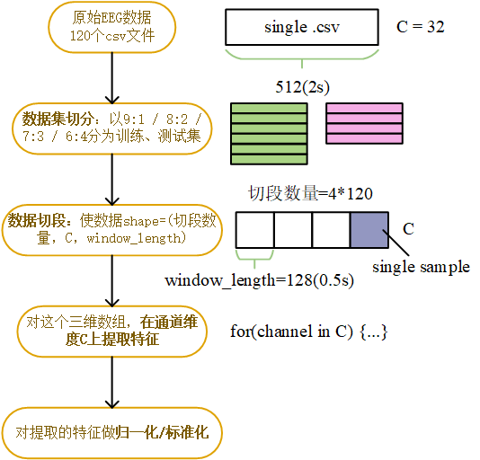

## 参考资料

* [Python脑电数据处理中文手册 v2.0](https://github.com/Karia70/Python-EEG-Handbook-CN)
* [馒头脑机BCI课程](https://www.bilibili.com/video/BV1TH4y1E7qd/)
* [wiki-人脑](https://zh.wikipedia.org/wiki/%E4%BA%BA%E8%85%A6)
* [数据清洗](https://blog.csdn.net/liumengqi11/article/details/113174269)

## 专业名词
EEG：Electroencephalography  脑电图
EOG：Electrooculography  眼电图
EMG: Electromyography  肌电图
PPG：Photoplethysmography  光电容积描记法：使用光源（如 LED）发射光线到皮肤上，然后通过光电探测器（如光电二极管）接收从皮肤反射或透射回来的光线。由于血液中的血红蛋白对光的吸收率不同，当心脏泵血时，血液在血管中的体积变化会导致反射或透射的光量发生变化。通过分析这些光强度的变化，可以推测出心率、血氧饱和度等生理参数
spikes: 尖峰放电，指的是神经元的动作点位
gdf文件：General Data Format  生物医学数据文件，包含文件头+信号数据（时间序列）  
IEM: Inverse Encoding Model  反向编码模型：基于观测到的神经活动数据，逆向推断出导致这些神经活动的外部刺激。
N-Back: 一种心理学/神经科学实验范式，要求参与者在当前刺激出现时，回忆出N步之前出现的刺激。
DBS：Deep Brain Stimulation  深脑部刺激：通过在大脑深部特定区域植入电极，利用电刺激来调节神经活动，以治疗各种神经和精神疾病。
SSVEP: Steady-State Visually Evoked Potential  稳态视觉诱发电位：一种在视觉刺激以固定频率闪烁时，记录在大脑视觉皮层的持续性电位响应。


# BCI综述

## 人体大脑构造

成人脑通常重达1～1.5千克，体积平均为1,600立方厘米。大脑由**两个半球**组成，它们通过组成**胼胝体**的大量神经细胞连接在一起。大脑皮层进一步分为**四个脑叶**。每个脑叶都有左右两个对应的脑叶，大脑两个半球之间又有细微的差别。

*人脑脑叶分区——Henry Gray (1918年)*

* 枕叶：包含初级视觉皮质，能够进行**视觉处理**。包括低水平的视觉空间处理（方位、空间频率）、颜色辨别和运动感知。
* 颞叶：负责利用**视觉记忆、语言和情感**来联系感官输入、从而衍生出更高层次的意义。其中又有一些分区：
  * 韦尼克区：位于顶叶边缘，**语言理解**相关；
  * 海马体：位于颞叶内侧，能够形成长期记忆，与**情感**相关；
  * 颞上回：**听觉**信息处理中枢。
    颞叶还具有高级视觉功能，能够进行物体和人脸的识别。
* 顶叶：能够处理各类**感觉**信息，如触觉、嗅觉、味觉，同时也和**语言和记忆**有关。负责**整合外部信息以及内部感觉反馈**，合并成一个连贯的表征，来描述我们的身体如何与环境联系，以及环境中的所有事务在空间上如何与我们联系。同时顶叶皮层还负责处理、存储和检索要抓住物体的形状、大小和方向。此外，顶叶似乎与自我加工和代理感受相关。
* 额叶：最高级部分，具有**高级认知功能**（思考）。能够进行判断、思考、分析、演算和计划，并且与人的**需求以及情感**相关。包含**运动**区域，可以控制四肢和眼睛的自主运动。

## 脑电信号

脑电信号是大脑皮层或者头皮表面记录到的大脑皮层神经元群突触后点位的总和。为了探索人体大脑奥秘，**在大脑和外部环境之间建立起一种直接的通讯交流渠道**成为非常必要的手段，这就是如今广为研究的“脑-机接口”（Brain-Computer Interface, BCI）。通过对脑机接口的脑电认知的研究，我们可以了解神经细胞电活动与人们心理活动、生理活动之间的联系，这在临床医学领域具有重大意义。

## 脑电信号分类

|         | 频率范围(Hz) | 振幅范围(μv) | 可检测区域     | 出现场景                                 |
| ------- | ------------ | ------------- | -------------- | ---------------------------------------- |
| delta波 | 0.1~4        | 20~200        | 状态相关       | 深度睡眠、昏迷、缺氧                     |
| theta波 | 4~8          | 10~50         | 精神相关       | 精神困倦、抑郁、运动想像                 |
| alpha波 | 8~13         | 20~100        | 枕叶、顶叶     | 清醒、安静、闭眼、运动、运动想像         |
| beta波  | 13~30        | 5~20          | 额部、颞部     | 注意力集中、情绪波动、警觉和焦虑         |
| gamma波 | 30~70        | 很小         | 额区、前中央区 | 物体识别、声音、触觉、短时记忆、强烈刺激 |

脑电信号分析中，预处理的依据（带通滤波）

## 行业前沿——Neuralink
* **2019年推出第一个植入式BCI设备**：该设备将1024根电极天线植入到大脑的某跨区域，采集脑电信号，通过无线传输方式将信号传输到终端
* **2021年展示玩“Mind Pong”的猴子**：解码了猴子用来控制手的大脑信号。融资2.05亿美元。
* **Neuralink的核心技术和目标：** 通过自动外科手术机器人将Link以开颅的方式 植入大脑内部，然后Link通过蓝牙将处理后的 神经信息传递，并与外部设备（NeuralinkApp）相连，进而做出打字、移动等反应，最终实现用思考去操作外设的效果。
    * 当前目标：通过意念操纵手机
    * 终极目标：人类意识上传芯片，完成永生。（推测至少需百万导联级别的EEG采集设备）
* 我国与美国差距：
    * 上层技术：芯片  
    * 中层技术：BCI采集设备   256导联<--->1024导联
* BCI目前发展的程度（待补充）：
    * **数据数量和质量**：在脑机接口领域，要么信号质量和空间分辨率非常有限（非侵入式），要么使用起来有临床风险并很快会排异（侵入式），某种意义上正如同早期的黑白胶卷相机，使用起来不易且信号质量有限。 数据的质量决定了模型训练的最终结果。
    * **硬件上的新突破**使得信号质量和易用性之间的平衡更容易达到，比如g.tec的**g.PANGOLIN**在非侵入式路线里可能最典型的**EEG**技术下实现了**1024电极的分辨率**，中科院微系统所最近发表的**以蚕丝为载体的侵入式电极**在解决排异性和减小手术创口上也达到了比较突破的水平。
    * 采集设备的**易用度**也限制了大众提供海量数据。
## 脑机接口技术及研究意义
  ———https://www.bilibili.com/video/BV1TH4y1E7qd

根据脑信号采集方式分类：
* **侵入式脑机接口**：直接植入电极或传感器到大脑内部来获取脑电信号。**信号分辨率更高，存在风险。**
* **非侵入式脑机接口**：通过外部设备或传感器记录大脑的电活动。**信号分辨率低，安全。**

根据BCI范式/感觉刺激/采用信号分类：
* 单一范式/单一感觉刺激/单一脑信号的脑机接口
* **混合脑机接口**

**研究意义（待补充）：**
1. 医疗领域：
    * 脑疾病治疗、功能恢复
    * 脑疾病药物研发、临床试验 
1. 游戏
1. 其他

## 国内外政策驱动
  ———https://www.bilibili.com/video/BV1TH4y1E7qd

“中国脑计划”提出**一体两翼**
* 一体：大脑对外界环境的感官认知、如人的注意力、学习、记忆以及决策制定等；对人类以及非人灵长类自我意识的认知；对语言的认知
* 两翼：
    * 脑疾病诊断和治疗
    * 类脑人工智能研发


# BCI IV2A下载 + DL建模 + 结果可视化
## 数据集
BCI IV2A发布与2008年，简洁明了，产生过约几十万篇论文。[下载地址](bbci.de/competition/iv/index.html)
9位被试者，4类动作（左手、右手、双脚、舌头），每位被试采集两轮数据（分别用于训练和测试），每项实验有6组动作，每次有**48组**（4类动作×12次重复）运动想像数据。总共有48×6=**288个trail**（样本量）。
## 深度学习建模
[代码步骤](./BCI-IV-2A.ipynb)

***
**脑电信号分析的神经网络搭建经验：**
* 神经网络每一层可以仿照EEGNet的三个block设计, 或者其他SOTA模型。第一层用时间卷积核提取时域信息，第二层用空间卷积核提取通道信息，下一步再用时间卷积核。
* 在第一个CNN层里可以设计成**时频**的卷积核，即二维 H * W 的卷积核。
* 可以先对局部特征进行提取，再提取全局的时间/空间特征（建议先时间后空间）。
* 池化建议使用平均（二维）池化，而不使用最大池化。池化层卷积核个数建议选择偶数而不是奇数。
***

## 数据预处理流程
1. 特殊类型文件：EDF、GDF、BDF、CNT、EGI、NXE  --使用```MNE```、```NK```（可生成数据）包
1. 常见的类型文件：.csv、.m、.npy  --手搓脚本处理
**以MNE + eeglab_data.set为例**
1. **读取数据**
1. **滤波**
    * 降采样
    * 带通滤波（高、低通滤波）
    * 工频滤波
1. **数据归一化**：```sklearn.preprocessing.MinMaxScaler```
   **数据标准化**：```sklearn.preprocessing.StandarScaler```
   **标签独热编码**：**OneHotEncoder**（按位与）、LabelEncoder
   （先标准化，效果不好则换用归一化）
1. **去伪迹**
    * 去除坏导：即筛选通道，对数据本身质量差的，不需要的眼电/眼动通道筛选，或者筛选脑电任务对应的特定脑区通道
    * ICA：去除每个通道眼电成分
1. **重参考**：根据参考电极，对其他所有通道做平均（一般不做）
1. **分段**（工作量大）：
    * 对特殊类型数据：也就是使用```MNE```的```get_evet```提取事件数据
    * 对非特殊类型：手搓，对完整的EEG数据作切断，需要依据处理的EEG信号做分析，设计适合的窗长和窗移。切完之后，数据升维。
1. **叠加平均**：类似重参考，所有通道先叠加再取均值
1. **时频分析**：分析处理EEG的时域、频域成分，哪些是需要的，利于分类的特征，主要用于ML的特征提取
1. **提取数据**

# EEG的特征域
时域：采集时长
频域：生理信号频率
空域：采集设备电极数
## 时域
一段时间内EEG波段的**峰值**，可以用来区分不同类别的数据。对于这个时间段的**波幅**，求**Mean/Avg/Std**，用来作为该数据的**特征之一**。
**典型特征**：
1. 波形中提取：波长、零交率ZCR、坡度变化
1. 统计学特征：max, min, mean, median, 偏度skewness, 峰度kurtosis[自动检测异常], histogram, Interquartile range, mean/median absolute deviation, root meansquare, std, variance, 经验分布函数百分位数（Empirical Distribution Function Percentile Count）, 经验分布函数斜率(ECDF Slope)
1. 混沌分形理论特征：各种熵， Higuchi分形维数

## 频域
把脑电频率分为[5个子频段](#脑电信号分类), 其原理是生物电信号的频谱信息可能会根据不同的实验条件或情况发生变化，因此它可以编码与任务相关的信息，揭示生物电信号是如何产生的。
**频域特征提取技术**：离散傅里叶变换（DFT）， 功率谱密度（PSD）（**一种技术而非特征**）， 基于自回归模型的频谱估计

## 时频域
时域特性不提供振荡信息，而在频率分析的情况下，并没有提供详细的频谱信号随时间变化的信息（这些是ECG和EEG等研究的重要关注点），对于这一限制，可以通过时频分析来解决。
**时频算法**：
* 短时傅里叶变换（STFT）
* Morlet小波（MW）
* 基于滤波器的希尔伯特变换

## 空域
同一个时间点下对脑电不同通道进行特征提取，常见CSP(Constraint Satisfaction Problem)算法

# 情绪识别
**脑电情绪主要研究方向：**
* **离散法**：把情绪数据分为离散状态 （如喜悦、悲伤、惊讶、恐惧、愤怒、厌恶）
* **维数法**：把情感数据分为三个维度 （效价、唤醒、支配）
1. 效价（Valence）
效价描述了情感体验的积极性或消极性。它表示情感是愉快的还是不愉快的：
正效价：积极的情感，如快乐、兴奋、满意等。
负效价：消极的情感，如悲伤、愤怒、厌恶等。

2. 唤醒（Arousal）
唤醒描述了情感体验的激活程度或唤醒水平。它表示情感是激动的还是平静的：
高唤醒：高能量、高激动的情感，如愤怒、兴奋、惊讶等。
低唤醒：低能量、平静的情感，如放松、悲伤、无聊等。

3. 支配（Dominance）
支配描述了个体对情感体验的控制感或支配感。它表示情感是控制的还是被控制的：
高支配：个体感到对情感和环境有控制力，如自信、权威。
低支配：个体感到被情感和环境控制，如恐惧、无助。

**情绪识别主要特征**：

EEG信号中较高频带与秦旭的产生和后续变化密切相关，可以从这些频带中提取特征，可以从theta、alpha、beta、gamma频带中提取**PSD特征**，在**维数**上进行分类

# 提取三维EEG特征并归一化
## 特征数据SHAPE的正确输入
对于EEG数据，无论它是.csv, .m, .np的普通格式，还是BDF, GDF等特殊格式，它通常是  C*T 的shape。首先需要对其进行**预处理**，然后根据需求进行**特征提取**作为输入（或输入原始信号）。

切段后的```EEG_data_shape=(480,32,128)```, 经过频域功率谱密度技术的提取，每个channel我们可以得到1个频域特征（即一段能提取32个特征）。

## NeuroKit2 For EEG Analysis
[NeuroKit2](https://neuropsychology.github.io/NeuroKit/index.html)
### 使用NK对EEG信号预处理
1. 数据导入
2. EEG信号模拟，生成假的脑电信号:  ```signal_simulate()```
3. EEG信号标准滤波:  ```signal_filter()```
4. EEG信号重采样： ```signal_resample()```
5. EEG数据缺失值处理： ```signal_fillmissing()```
6. EEG信号二值化处理： ```signal_binarize()```
7. EEG信号分析： ```signal_decompose()```  (EMD、SSA等分解方法)
8. 去除坏导：```eeg_badchannels()```
9. EEG权脑差异分析： ```eeg_diss()```
10. EEG全脑场强提取： ```eeg_gfp()```
11. EEG不同频带功率的提取: ```eeg_power()```
12. EEG重参考： ```eeg_reference()```

### 使用NK调用NME
NK中可直接调用NME，来完全实现MNE中的所用功能
```nk.mne_xxx()```

### 使用NK对EEG做微观状态分析
NK中可调用不同的聚类方法，从EEG原始信号中提取微观状态，进行全局解释方差GEV衡量
功能：提取、可视化、数值排序、提纯处理、动态特性分析、最佳数量提取、峰值定位、静态分析

### 使用NK对Event做分析
NK可以创造一个假的包含Event信息的EEG信号，以供学习，包含功能：
* 事件信息创造（可与mne兼容）
* 事件信息定位
* 事件信息可视化

### 代码：使用NK提取EEG特征
**时域：查找峰值**：
```python
import neurokit2 as nk

# Simulate a Signal
signal = nk.signal_simulate(duration=5)

info = nk.signal_findpeaks(signal)

# Visualize Onsets of Peaks and Peaks of Signal
nk.events_plot([info["Onsets"], info["Peaks"]], signal)
```

**频域：提取功率谱密度能量特征**：
```python
import neurokit2 as nk

signal = nk.signal_simulate(duration=2, frequency=[5, 6, 50, 52, 80], noise=0.5)

# FFT method (based on numpy)
psd_multitapers = nk.signal_psd(signal, method="fft", show=True)
```