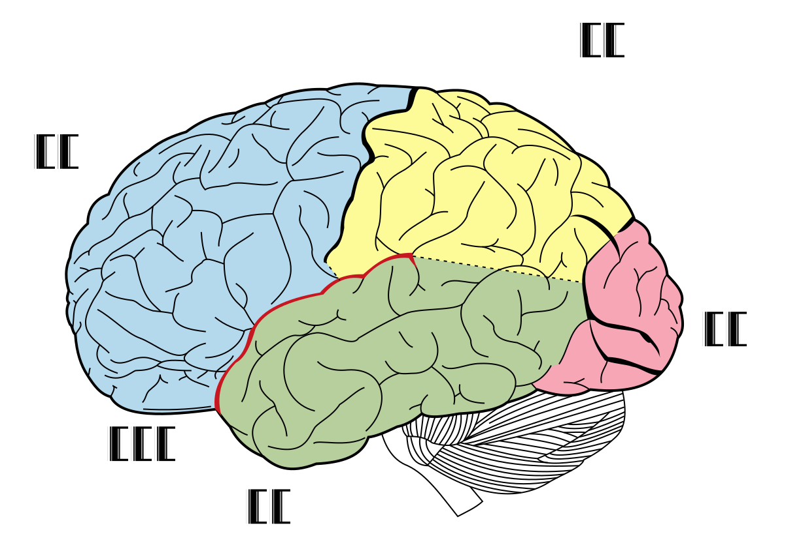
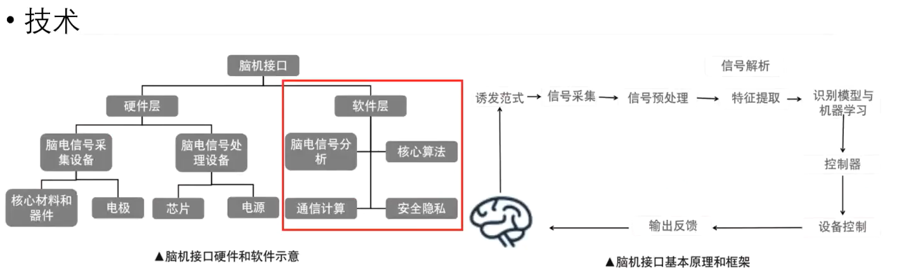
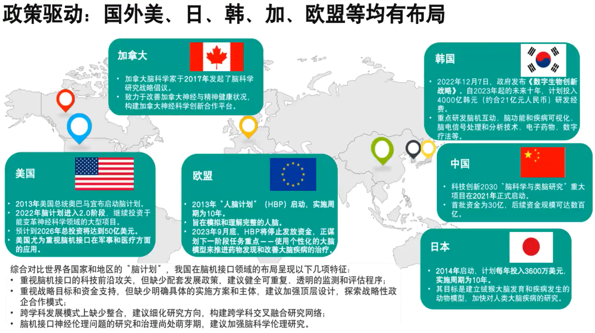

## 参考资料

* [馒头脑机BCI课程](https://www.bilibili.com/video/BV1TH4y1E7qd/)
* [wiki-人脑](https://zh.wikipedia.org/wiki/%E4%BA%BA%E8%85%A6)

## 专业名词
EEG：Electroencephalography  脑电图
spikes: 尖峰放电，指的是神经元的动作点位
gdf文件：General Data Format  生物医学数据文件，包含文件头+信号数据（时间序列）  学习MNE-Python

# BCI综述

## 人体大脑构造

成人脑通常重达1～1.5千克，体积平均为1,600立方厘米。大脑由**两个半球**组成，它们通过组成**胼胝体**的大量神经细胞连接在一起。大脑皮层进一步分为**四个脑叶**。每个脑叶都有左右两个对应的脑叶，大脑两个半球之间又有细微的差别。

*人脑脑叶分区——Henry Gray (1918年)*

* 枕叶：包含初级视觉皮质，能够进行**视觉处理**。包括低水平的视觉空间处理（方位、空间频率）、颜色辨别和运动感知。
* 颞叶：负责利用**视觉记忆、语言和情感**来联系感官输入、从而衍生出更高层次的意义。其中又有一些分区：
  * 韦尼克区：位于顶叶边缘，**语言理解**相关；
  * 海马体：位于颞叶内侧，能够形成长期记忆，与**情感**相关；
  * 颞上回：**听觉**信息处理中枢。
    颞叶还具有高级视觉功能，能够进行物体和人脸的识别。
* 顶叶：能够处理各类**感觉**信息，如触觉、嗅觉、味觉，同时也和**语言和记忆**有关。负责**整合外部信息以及内部感觉反馈**，合并成一个连贯的表征，来描述我们的身体如何与环境联系，以及环境中的所有事务在空间上如何与我们联系。同时顶叶皮层还负责处理、存储和检索要抓住物体的形状、大小和方向。此外，顶叶似乎与自我加工和代理感受相关。
* 额叶：最高级部分，具有**高级认知功能**（思考）。能够进行判断、思考、分析、演算和计划，并且与人的**需求以及情感**相关。包含**运动**区域，可以控制四肢和眼睛的自主运动。

## 脑电信号

脑电信号是大脑皮层或者头皮表面记录到的大脑皮层神经元群突触后点位的总和。为了探索人体大脑奥秘，**在大脑和外部环境之间建立起一种直接的通讯交流渠道**成为非常必要的手段，这就是如今广为研究的“脑-机接口”（Brain-Computer Interface, BCI）。通过对脑机接口的脑电认知的研究，我们可以了解神经细胞电活动与人们心理活动、生理活动之间的联系，这在临床医学领域具有重大意义。

## 脑电信号分类

|         | 频率范围(Hz) | 振幅范围(μv) | 可检测区域     | 出现场景                                 |
| ------- | ------------ | ------------- | -------------- | ---------------------------------------- |
| delta波 | 0.1~4        | 20~200        | 状态相关       | 深度睡眠、昏迷、缺氧                     |
| theta波 | 4~8          | 10~50         | 精神相关       | 精神困倦、抑郁、运动想像                 |
| alpha波 | 8~13         | 20~100        | 枕叶、顶叶     | 清醒、安静、闭眼、运动、运动想像         |
| beta波  | 13~30        | 5~20          | 额部、颞部     | 注意力集中、情绪波动、警觉和焦虑         |
| gamma波 | 30~70        | 很小         | 额区、前中央区 | 物体识别、声音、触觉、短时记忆、强烈刺激 |

脑电信号分析中，预处理的依据（带通滤波）

## 行业前沿——Neuralink
* **2019年推出第一个植入式BCI设备**：该设备将1024根电极天线植入到大脑的某跨区域，采集脑电信号，通过无线传输方式将信号传输到终端
* **2021年展示玩“Mind Pong”的猴子**：解码了猴子用来控制手的大脑信号。融资2.05亿美元。
* **Neuralink的核心技术和目标：** 通过自动外科手术机器人将Link以开颅的方式 植入大脑内部，然后Link通过蓝牙将处理后的 神经信息传递，并与外部设备（NeuralinkApp）相连，进而做出打字、移动等反应，最终实现用思考去操作外设的效果。
    * 当前目标：通过意念操纵手机
    * 终极目标：人类意识上传芯片，完成永生。（推测至少需百万导联级别的EEG采集设备）
* 我国与美国差距：
    * 上层技术：芯片  
    * 中层技术：BCI采集设备   256导联<--->1024导联
* BCI目前发展的程度（待补充）：
    * **数据数量和质量**：在脑机接口领域，要么信号质量和空间分辨率非常有限（非侵入式），要么使用起来有临床风险并很快会排异（侵入式），某种意义上正如同早期的黑白胶卷相机，使用起来不易且信号质量有限。 数据的质量决定了模型训练的最终结果。
    * **硬件上的新突破**使得信号质量和易用性之间的平衡更容易达到，比如g.tec的**g.PANGOLIN**在非侵入式路线里可能最典型的**EEG**技术下实现了**1024电极的分辨率**，中科院微系统所最近发表的**以蚕丝为载体的侵入式电极**在解决排异性和减小手术创口上也达到了比较突破的水平。
    * 采集设备的**易用度**也限制了大众提供海量数据。
## 脑机接口技术及研究意义
  ———https://www.bilibili.com/video/BV1TH4y1E7qd

根据脑信号采集方式分类：
* **侵入式脑机接口**：直接植入电极或传感器到大脑内部来获取脑电信号。**信号分辨率更高，存在风险。**
* **非侵入式脑机接口**：通过外部设备或传感器记录大脑的电活动。**信号分辨率低，安全。**

根据BCI范式/感觉刺激/采用信号分类：
* 单一范式/单一感觉刺激/单一脑信号的脑机接口
* **混合脑机接口**

**研究意义（待补充）：**
1. 医疗领域：
    * 脑疾病治疗、功能恢复
    * 脑疾病药物研发、临床试验 
1. 游戏
1. 其他

## 国内外政策驱动
  ———https://www.bilibili.com/video/BV1TH4y1E7qd

“中国脑计划”提出**一体两翼**
* 一体：大脑对外界环境的感官认知、如人的注意力、学习、记忆以及决策制定等；对人类以及非人灵长类自我意识的认知；对语言的认知
* 两翼：
    * 脑疾病诊断和治疗
    * 类脑人工智能研发

# BCI IV2A下载 + DL建模 + 结果可视化
## 数据集
BCI IV2A发布与2008年，简洁明了，产生过约几十万篇论文。[下载地址](bbci.de/competition/iv/index.html)
9位被试者，4类动作（左手、右手、双脚、舌头），每位被试采集两轮数据（分别用于训练和测试），每项实验有6组动作，每次有**48组**（4类动作×12次重复）运动想像数据。总共有48×6=**288个trail**（样本量）。
## 深度学习建模
[代码步骤](./BCI-IV-2A.ipynb)